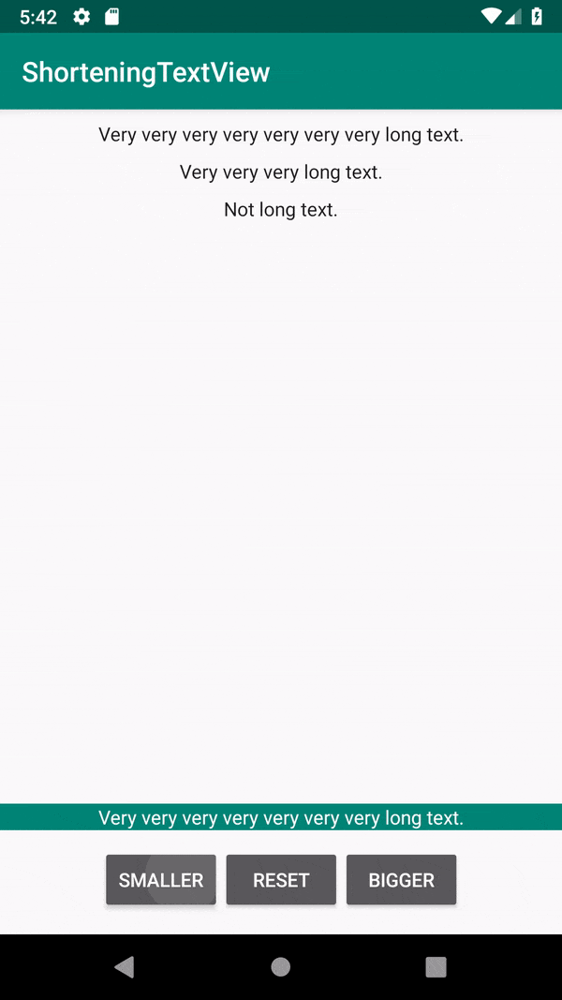

[  ](https://bintray.com/alexfacciorusso/ShorteningTextView/com.alexfacciorusso.shorteningtextview/_latestVersion)

# ShorteningTextView

A TextView that shows the right text based on its size!

## Installation

Add the following line in the `dependencies` section of your `build.gradle`:

    implementation 'com.alexfacciorusso.shorteningtextview:shorteningtextview:0.1.0'

## Usage

Use the `com.alexfacciorusso.shorteningtextview.ShorteningTextView` view into your layouts.

```
    <com.alexfacciorusso.shorteningtextview.ShorteningTextView
        android:id="@+id/shorteningTextView"
        app:stv_texts="@array/example_strings" 
        ... />
```

where `@array/exampe_strings` is an array of strings defined as a resource.

If you want to set the texts in a programmatic way (we all love setting views programmatically,
don't we?), a property `texts` (Kotlin) or `setTexts/getTexts` (Java) is available!

### Kotlin

```kotlin
        val sampleStrings = resources.getStringArray(R.array.example_strings)

        // Notice the `.toList()` since `texts` is a List<String> but Resources.getStringArray
        // returns, of course, an array.
        shorteningTextView.texts = sampleStrings.toList()
        
        // Or also:
        shorteningTextView.texts = listOf("My very long string", "My string")
```

### Java

```java
        final String[] sampleTexts = getResources().getStringArray(R.array.example_strings);

        // Notice the `Arrays.asList` since `texts` is a List<String> but Resources.getStringArray
        // returns, of course, an array.
        shorteningTextView.setTexts(Arrays.asList(sampleTexts));
```

## Sample



## License

Copyright 2018 Alex Facciorusso.

Licensed under the Apache License, Version 2.0 (the "License");
you may not use this file except in compliance with the License.
You may obtain a copy of the License at

   http://www.apache.org/licenses/LICENSE-2.0

Unless required by applicable law or agreed to in writing, software
distributed under the License is distributed on an "AS IS" BASIS,
WITHOUT WARRANTIES OR CONDITIONS OF ANY KIND, either express or implied.
See the License for the specific language governing permissions and
limitations under the License.